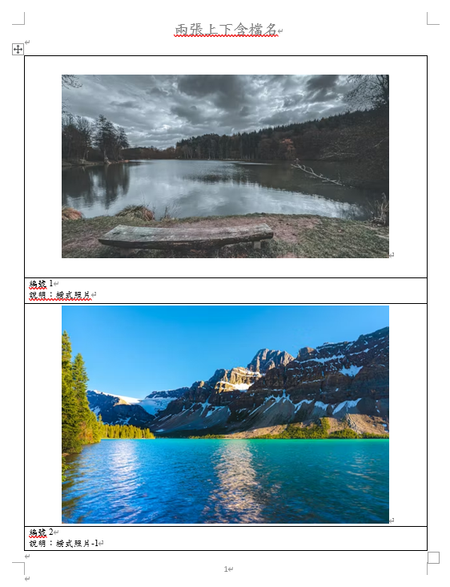
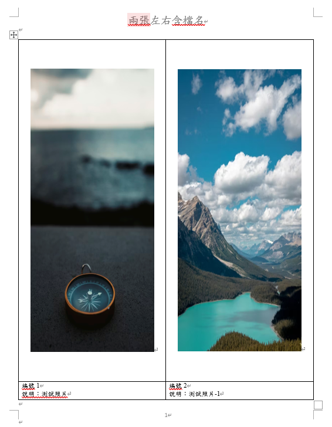
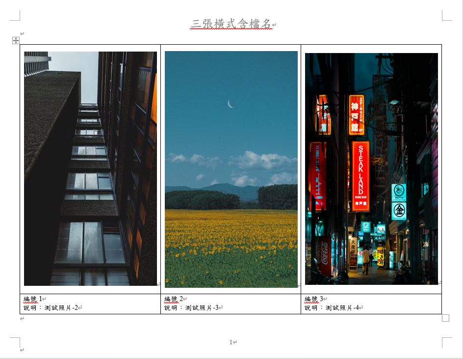

# 酷酷的照片黏貼表

一個用 PyQt6 製作的圖片彙整工具，可將多張照片自動排版並輸出成 Word 文件（.docx）。

---

## 介面預覽


> 左側為操作區，右側為即時預覽面板（選圖後自動展開）。

---

## 輸出範例

### 兩張上下含檔名

<div align="center">
  
</div>

### 兩張左右含檔名

<div align="center">
  
</div>

### 三張橫式含檔名

<div align="center">
  
</div>

---

## 功能特色

- 多張照片一次選取，自動依檔名排序
- 六種排版模式，可隨時切換：
  - 兩張上下（含檔名 / 純編號）
  - 兩張左右（含檔名 / 純編號）
  - 三張橫式（含檔名 / 純編號）
- 含檔名模式：每張照片下方顯示「編號」與「說明」兩行，說明文字自動縮小字型（12pt → 8pt）確保不換行
- 點擊「預覽排版」可事先看到排版縮圖，不需產生文件
- 右側即時預覽縮圖，可拖曳調整照片順序
- 雙擊卡片名稱可就地編輯單張照片名稱
- 批量改名工具列：指定範圍 + 新名稱，一次套用
- 單張點 ✕ 刪除照片
- 選圖後自動帶入預設輸出資料夾
- 頁首標題可自訂
- 支援 JPEG、PNG、WEBP、HEIC 等格式（含中文路徑）
- 執行時背景處理，UI 不凍結

---

## 環境需求

- Python 3.10+
- 相依套件：

```
pip install PyQt6 python-docx Pillow pillow-heif
```

---

## 執行方式

```bash
python py檔/ui.py
```

或直接執行打包好的 exe：

```
dist/酷酷的照片黏貼表.exe
```

---

## 專案結構

```
.
├── README.md
├── docs/                          # 截圖素材
├── word模板別動.docx              # 直向 Word 模板
├── word橫向模板別動.docx          # 橫向 Word 模板
├── 酷酷的照片黏貼表.spec          # PyInstaller 打包設定
├── dist/
│   └── 酷酷的照片黏貼表.exe       # 打包好的執行檔
└── py檔/
    ├── ui.py                      # 主程式（PyQt6 UI + 排版邏輯）
    ├── common.py                  # 共用工具函式
    └── archive/                   # 備份用獨立腳本
```

---

## 打包成 exe

> 專案路徑含中文，需在 `C:\build_tmp` 執行打包。

```powershell
Remove-Item -Recurse -Force "C:\build_tmp\py檔"
Copy-Item -Recurse -Force ".\py檔" "C:\build_tmp\py檔"
Remove-Item -Recurse -Force "C:\build_tmp\build","C:\build_tmp\dist"
cd C:\build_tmp
pyinstaller --noconfirm "酷酷的照片黏貼表.spec" --distpath "C:\build_tmp\dist" --workpath "C:\build_tmp\build"
```

---

## 作者

ft. 林瑾孝
